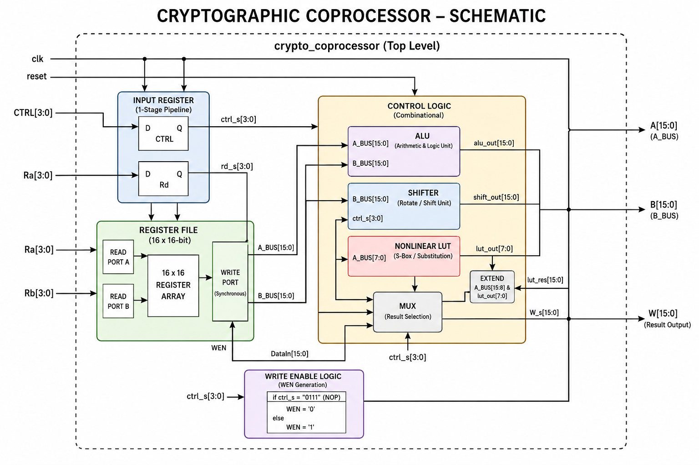

# 16-bit Cryptographic Coprocessor

>**Faculty of Engineering
>· Zagazig University** >
>**Supervised by: Dr. Howida Abd AlLatif**


---

A 16-bit hardware cryptographic coprocessor implemented in VHDL.
The design accelerates common cryptographic-oriented operations by executing them directly in hardware instead of software.

The coprocessor integrates:

* Arithmetic operations
* Bitwise logic
* Shift and rotation units
* Non-linear lookup transformations
* Register-based pipelined execution

This architecture demonstrates how dedicated hardware can improve throughput, timing predictability, and overall computational efficiency for cryptographic workloads.

---

# Features

## Arithmetic Operations

* ADD
* SUB

## Logical Operations

* AND
* OR
* XOR
* NOT
* MOV

## Shift / Rotation Operations

* Rotate Right by 8
* Rotate Right by 4
* Shift Left Logical by 8

## Non-Linear Transformation

* LUT-based substitution unit (S-Box style transformation)

## Register File

* 16 Registers
* 16-bit width
* Asynchronous read
* Synchronous write

## Pipeline Support

The design includes an `input_register` stage that introduces:

* 1-cycle latency
* Improved timing behavior
* Cleaner synchronous execution
* Better synthesis scalability

---

# Why Hardware Acceleration?

Cryptographic algorithms repeatedly execute the same mathematical and bit-level operations.

Executing these operations in software can become expensive in terms of:

* CPU cycles
* Power consumption
* Latency

Dedicated hardware acceleration provides:

* Faster execution
* Parallel processing capability
* Deterministic timing
* Reduced CPU workload
* Better throughput
* Constant-time behavior against timing attacks

---

# Top-Level Architecture

## Schematic 



## Main Components

The project consists of the following modules:

| Module               | Description                        |
| -------------------- | ---------------------------------- |
| `crypto_coprocessor` | Top-level entity                   |
| `register_file`      | 16x16 register bank                |
| `input_register`     | Pipeline stage for control signals |
| `control_logic`      | Main combinational execution unit  |
| `ALU`                | Arithmetic and logical operations  |
| `shifter`            | Shift and rotation unit            |
| `nonlinear_lut`      | Non-linear substitution block      |

---

# Data Flow

```text
CTRL/Rd
   │
   ▼
┌─────────────────┐
│ input_register  │
└────────┬────────┘
         │
         ▼
   ctrl_s / rd_s
         │
         ▼
┌─────────────────┐
│ register_file   │
│ 16 x 16-bit     │
└──────┬─────┬────┘
       │     │
       ▼     ▼
     A_BUS  B_BUS
       │     │
       └──┬──┘
          ▼
┌────────────────────┐
│   control_logic    │
│                    │
│  ┌──────────────┐  │
│  │     ALU      │  │
│  └──────────────┘  │
│                    │
│  ┌──────────────┐  │
│  │   shifter    │  │
│  └──────────────┘  │
│                    │
│  ┌──────────────┐  │
│  │ nonlinear_lut│ │
│  └──────────────┘  │
└─────────┬──────────┘
          │
          ▼
         W_s
          │
          ▼
   register_file write-back
```

---

# Pipeline Behavior

The coprocessor uses a 1-stage pipeline through the `input_register`.

## Execution Sequence

### Cycle N

Inputs are applied:

* `CTRL`
* `Ra`
* `Rb`
* `Rd`

### Rising Edge (N+1)

The `input_register` captures:

* `ctrl_s`
* `rd_s`

Then:

* `control_logic` computes the result combinationally
* `register_file` writes the result back

### Result Availability

`W` becomes valid after the clock edge.

This behavior is intentional and represents standard synchronous pipeline execution.

---

# Supported Instructions

| CTRL   | Operation          |
| ------ | ------------------ |
| `0000` | ADD                |
| `0001` | SUB                |
| `0010` | AND                |
| `0011` | OR                 |
| `0100` | XOR                |
| `0101` | NOT                |
| `0110` | MOV                |
| `0111` | NOP                |
| `1000` | ROR8               |
| `1001` | ROR4               |
| `1010` | SLL8               |
| `1x11` | LUT Transformation |

---

# Register File Initialization

The register file initializes with predefined values:

```text
R0  = 0x0001
R1  = 0x0002
R2  = 0x0003
...
R15 = 0x0010
```

---

# Project Structure

```text
project/
│
├── ALU.vhd
├── control_logic.vhd
├── crypto_coprocessor.vhd
├── input_register.vhd
├── nonlinear_lut.vhd
├── register_file.vhd
├── shifter.vhd
└── testbench.vhd
```

---

# Compilation Order

Compile the files in the following order:

```text
1. ALU.vhd
2. shifter.vhd
3. nonlinear_lut.vhd
4. input_register.vhd
5. register_file.vhd
6. control_logic.vhd
7. crypto_coprocessor.vhd
8. testbench.vhd
```

---

# Simulation Notes

Because the design contains a pipeline register stage, outputs appear after one clock cycle.

Example:

```vhdl
CTRL_tb <= "0000"; -- ADD

wait until rising_edge(clk);

assert W_tb = x"0015";
```

Do not check outputs immediately after driving inputs.

---

# Tools

This project can be simulated using:

* Active-HDL
* ModelSim
* Vivado Simulator
* QuestaSim

---

# Future Improvements

Possible future enhancements:

* Multi-stage pipelining
* Hazard forwarding
* Status flags (Zero / Carry / Overflow)
* AES-style S-Box expansion
* Dedicated encryption datapath
* Instruction decoder
* FSM-based controller
* Fully synchronous output stage

---

# Author

Developed in VHDL as a hardware cryptographic coprocessor project focused on:

* Digital Design
* Computer Architecture
* Cryptographic Hardware Acceleration
* FPGA-Oriented Synchronous Systems
